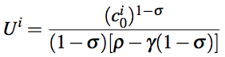
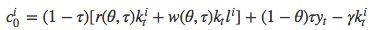
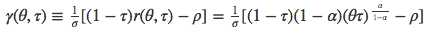
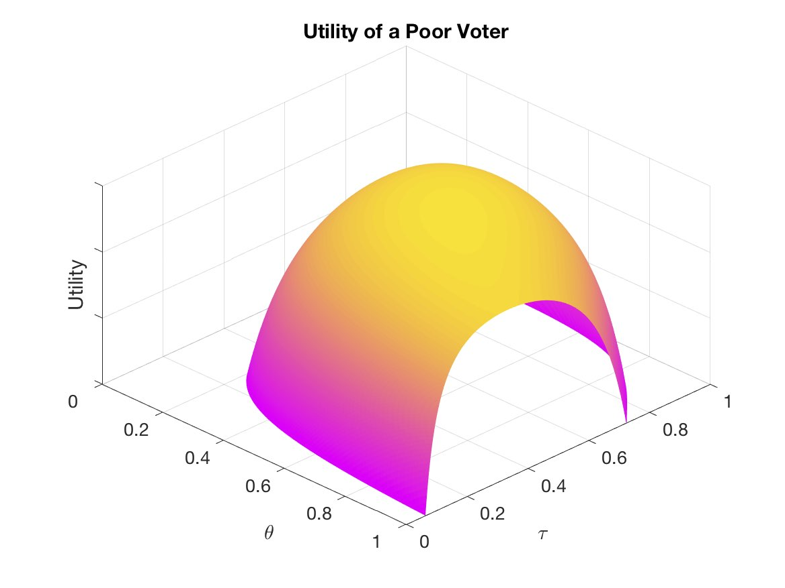
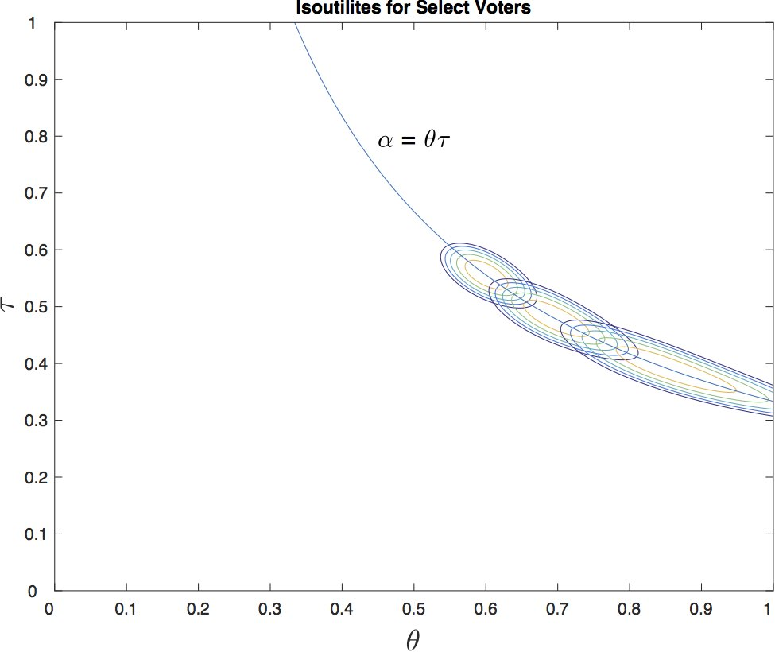
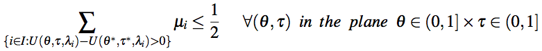
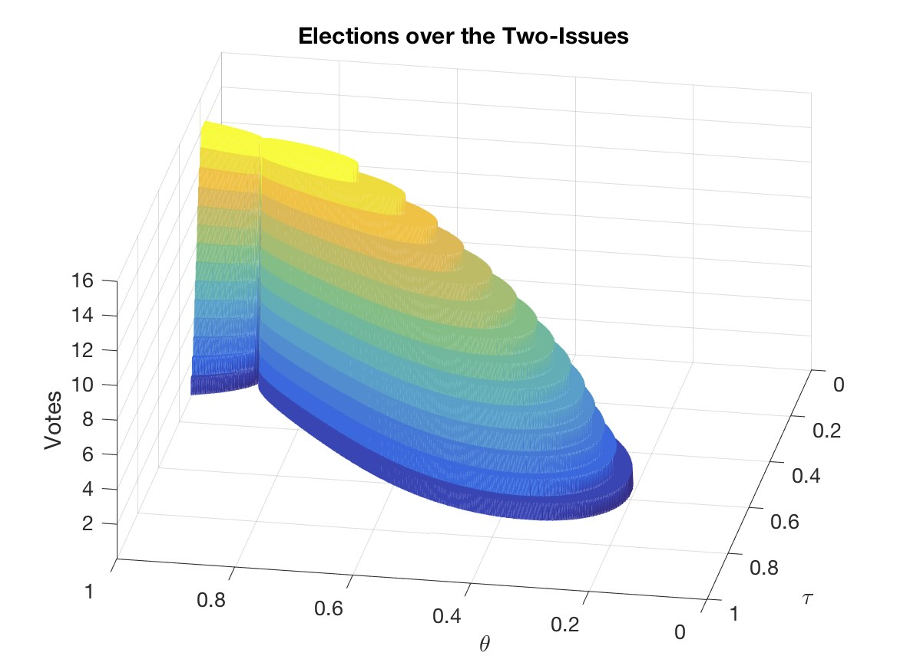

## Growth Implications of the Political Determination of Transfers and Public Investment (Simulation Scripts)  

### About the Paper  

The paper inquires into the effects of inequality on economic performance. A key assumption is that public spending is a complement to private inputs in the production process. Heterogeneity on the ability to earn income creates a conflict of interests between agents on public policy. Specifically, some agents differ on their most preferred tax rate, on how much of total tax revenue should be devoted to public investment, and how much should be devoted to income transfers. Results in a parameterized model of endogenous growth suggest that if the agent, who is the median in the distribution of income, is sufficiently poorer than the mean, a political outcome creates distortions that hinder economic growth. The result is mainly driven by the skewness of the income distribution. See the paper here [(PDF)]() [(HTML)](https://reyvaz.github.io/Inequality-and-Growth/ineq_growth.html).

### About the Files  

Numerical simulations were programed in Matlab for illustration and to complement parts of the analysis for which mathematical closed-form solutions were no longer viable, or practical. The programs have been updated for complete and easy reproducibility.  The main programs (i.e. those listed in the [reproduce.mlx](reproduce.mlx) script) are written to each run separately, so when reproducing the entire analysis, some redundant (although quick) set-ups will occur.

### Contents and Instructions
* It is recommended to clone the entire repository, even if only parts of the analysis are to be reproduced. 
* [reproduce.m](reproduce.m), and the live script [reproduce.mlx](reproduce.mlx), will reproduce all the graphical analysis in the paper as-is. Turn the switches on or off (true or false) to include or skip sections. Each section will run separately.   
* [reproduce.html](https://reyvaz.github.io/Inequality-and-Growth/reproduce.html) renders the live script and figures in html.
* [dist_gen.m](dist_gen.m) creates the (log-normal) productivity distribution.  
* [params.m](params.m) contains the main economy parameters. All programs depend on this. Alter values here to make robustness and model-sanity checks, as well as policy evaluations.   
* [goldensection.m](godensection.m) contains the Golden Section maximization algorithm.   
* [objfun.m](objfun.m) contains the utility function given by equation (15), with consumption at time zero substituted by its time invariant version shown in equation (13) with *r* = MPK  and *w* = MPL, as defined in equations (6) and (7) respectively, and growth as shown in equation (12), 

 
 

 

* [objfun2.m](objfun2.m) contains the same function as objfun.m, but it is used as an auxiliary for utility maximization over the public investment share.   
* [utilities.m](utilities.m) demonstrates concavity and single-peakedness of the utility function over the policy plane. Depicts indifference curves for select voters over the two issues.  

  

  

* [reaction_fns.m](reaction_fns.m)  calculates and plots the reaction functions for each voter over the two policy vectors. 
* [pareto_optimum.m](pareto_optimum.m) approximates the Pareto Optimum set of policy pairs.  
* [partial_election.m](partial_election.m) shows that the median voter's most preferred one-issue policies are also the Kramer-Shapsle and Stackelberg equilibria.   
* [gral_election.m](gral_election.m) produces the results of the two-issue Condorcet elections, where the winner is the candidate *i* for which all of its rivals' votes satisfy (equation 21),

  

  

* [policy_effects.m](policy_effects.m) once the median voter equilibrium has been established, it shows the economy's equilibrium policy pairs for different income distributions. Also shows the effects of these policies on growth.   
* [ineq_growth.html](https://reyvaz.github.io/Inequality-and-Growth/ineq_growth.html) renders the paper in HTML.

[GitHub Pages Link](https://reyvaz.github.io/Inequality-and-Growth/)

 
 

